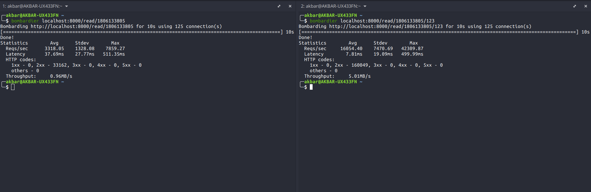

# Tugas 5 LAW

## Menjalankan aplikasi

* Pada 3 window berbeda jalankan hal berikut:

``` bash
cd update
go run main.go
```

``` bash
cd read
go run main.go
```

``` bash
sudo nginx -c ~/Academics/Tugas/LAW/Tugas5/reverse-proxy.conf
```

## Menggunakan aplikasi

Terdapat 3 skenario penggunaan aplikasi yaitu:

* menambah npm ke dalam database

```curl
curl --location --request POST 'localhost:8000/update' \
--header 'Content-Type: application/json' \
--data-raw '{
    "npm": "1806133805",
    "name": "Muhammad Aulia Akbar"
}'
```

* membaca npm tanpa caching

``` curl
curl --location --request GET 'localhost:8000/read/1806133805'
```

* membaca npm dengan caching

``` curl
curl --location --request GET 'localhost:8000/read/1806133805/123'
```

## Bechmarking

Berikut adalah skenario testing menggunakan bombardier:



Terlihat bahwa troughput dan jumlah request yang dilayani dengan cache mencapai 5 kali lebih banyak daripada yang tidak menggunakan cache. Hal ini menunjukkan efektifitas caching dari sisi proxy.
